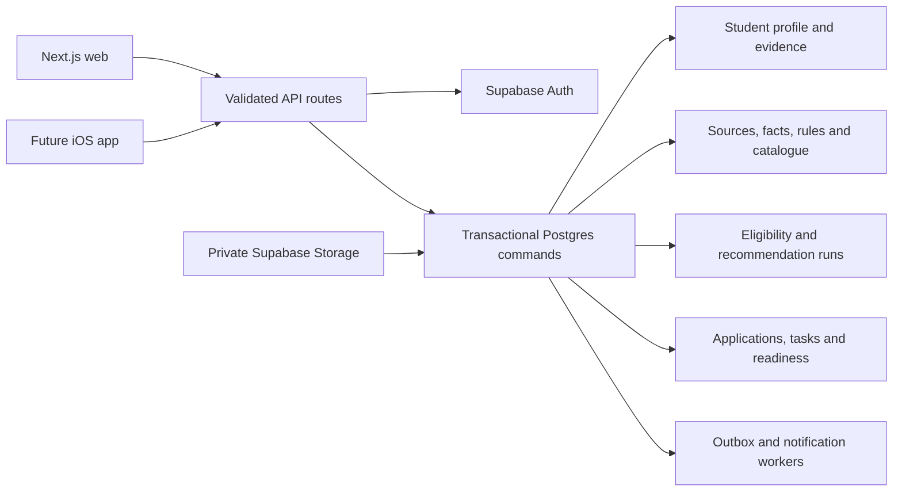
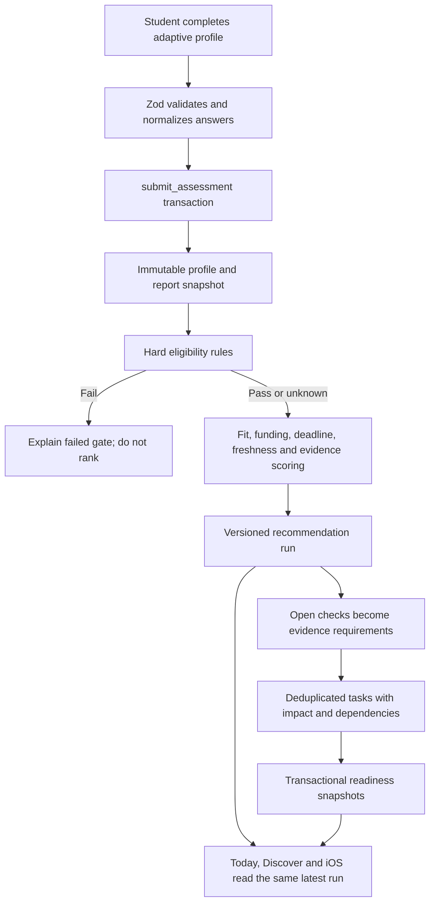

# ScholarPath backend architecture

## System shape

## Agreed student flow

## Trust boundaries

| Boundary | Enforcement |
|---|---|
| Student isolation | RLS plus composite `(entity_id, user_id)` foreign keys |
| System-generated records | Direct mutations revoked; authenticated RPC commands only |
| Research truth | Operator/reviewer separation and audited command function |
| Recommendation integrity | Engine, catalogue and rule versions stored with every run |
| Recommender confidentiality | One-time hashed token, private bucket, restricted column grants |
| Files | Signed upload, path ownership, object metadata verification and signed download |
| Abuse | Same-origin checks and Postgres-backed rate-limit buckets |
| Async reliability | Transactional outbox with attempts, availability and error state |

## Recommendation model

The deterministic engine has six visible components: eligibility 35, academic/criteria fit 25, funding 15, deadline feasibility 10, source freshness 10 and evidence 5. A failed hard rule or passed deadline produces a failed result with score zero. Missing hard evidence produces a conditional result. Stale-source results are capped and explicitly require reverification.

Every stored result retains reason codes, explanations, failed gates, open checks, next actions, score components, atomic rule versions, engine version, catalogue version and the profile snapshot used. Scores prioritize research; they do not predict acceptance.

## Database module map

- Identity and consent: `auth.users`, `student_profiles`, `user_roles`, `consent_events`.
- Profile intelligence: `assessments`, `profile_snapshots`, `pathway_reports`.
- Research truth: `source_records`, `source_snapshots`, `fact_records`, `atomic_rules`, `correction_tickets`.
- Catalogue: `programmes`, `scholarships`.
- Decisions: `recommendation_runs`, `recommendation_components`, `match_evaluations`.
- Planning: `portfolios`, `portfolio_items`, `applications`, `application_requirements`.
- Execution: `tasks`, `task_dependencies`, `task_impacts`, `task_events`, `task_reminders`, `application_readiness_snapshots`.
- Evidence: `documents`, `document_links`, `writing_items`, `recommenders`.
- Finance and results: `funding_scenarios`, `offers`.
- Platform: `notifications`, `audit_events`, `outbox_events`, `request_idempotency`, `api_rate_limits`, `import_batches`, `import_rows`.

## API contracts ready for web and iOS

- `POST /api/assessment`: atomic assessment, report, initial tasks and immediate catalogue evaluation.
- `POST /api/recommendations`: on-demand deterministic reevaluation.
- `GET /api/recommendations/latest`: one canonical latest result for all clients.
- `GET /api/catalogue`: bounded published catalogue query.
- `GET|POST /api/tasks`: Kanban state, impact and atomic transitions.
- `POST /api/tasks/generate`: idempotent requirement-to-task generation.
- `GET|POST /api/workspace`: student application workspaces.
- `/api/documents/*`: verified private upload and signed access.
- `/api/references/*`: confidential one-time recommender workflow.
- `GET|POST /api/operations`: role-separated source/fact review workflow.

## Definition of production-ready

Code completion is not deployment completion. The release gate is: migrations applied; generated DB types committed; zero Security Advisor errors; reviewed Performance Advisor findings; two-account isolation test passed; backup restore tested; SMTP and outbox worker configured; environment keys installed in Vercel; and a real onboarding-to-recommendation-to-task journey passed in preview and production.
