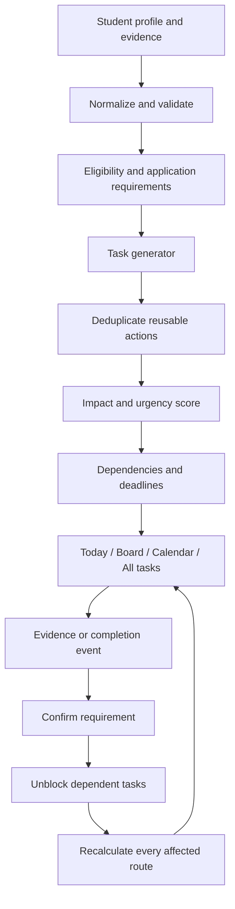
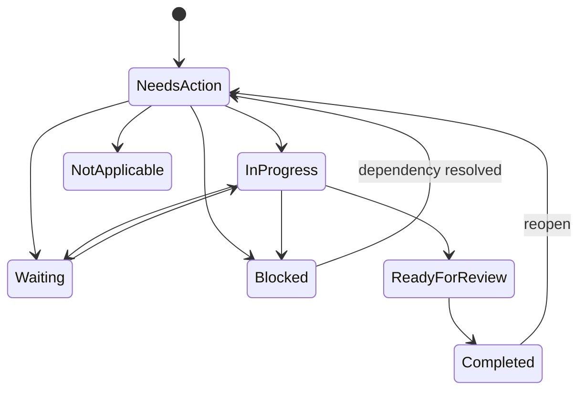

# ScholarPath execution engine

Implemented 31 July 2026. This module converts profile and application gaps into an explainable, deadline-aware action plan. It does not use an external AI API.

## System flow

## Implemented modules

- Task generator — creates tasks from missing, blocked, or needs-review requirements.
- Cross-route deduplication — one reusable evidence action can affect several applications.
- Impact engine — scores critical/high/medium/low impact using blocking status and deadline urgency.
- Next-best action — ranks overdue, actionable, high-impact work ahead of lower-value tasks.
- State machine — supports needs action, in progress, waiting, blocked, ready for review, completed, not applicable, and cancelled.
- Dependency engine — records blockers and automatically reopens downstream work when a prerequisite completes.
- Evidence model — stores required evidence, completion note, and linked completion document.
- Deadline model — stores due time, source, and timezone separately.
- Activity ledger — append-only history for creation, edits, movement, completion, reopening, and automatic unblocking.
- Readiness engine — creates per-application snapshots with confirmed, missing, blocking, and overdue-critical counts.
- Student command center — Today, Kanban, Calendar, All Tasks, filters, task details, personal tasks, and readiness overview.
- Demo mode — the entire interaction is usable without Supabase credentials; signed-in mode persists to Supabase.

## Task lifecycle

## Readiness behavior

Completing a system-generated requirement task confirms its source requirement, recalculates all applications referenced by the task impacts, writes a readiness snapshot, and unblocks any task that depended on it. Readiness is explainable: the score is supported by counts and the next task, not a hidden probability of admission.

## Main files

- `database/003_execution_engine.sql` — production schema, indexes, policies and event tables.
- `src/modules/tasks/engine.ts` — deterministic generation, ranking, transition and readiness rules.
- `src/modules/tasks/types.ts` — shared execution contracts.
- `src/modules/tasks/demo.ts` — full realistic demo workspace.
- `src/app/api/tasks/route.ts` — authenticated CRUD, transitions, events and readiness propagation.
- `src/app/api/tasks/generate/route.ts` — automatic requirement-to-task generation.
- `src/app/api/applications/[id]/readiness/route.ts` — latest application readiness.
- `src/lib/use-tasks.ts` — live/demo client state and automatic generation.
- `src/components/tasks/task-command-center.tsx` — complete student UX.
- `src/components/tasks/task-command-center.css` — responsive Urbanist/Untitled-style interface.

## Supabase activation

Run migrations in order: `001_foundation.sql`, `002_complete_product.sql`, then `003_execution_engine.sql`. The app currently falls back to demo mode when Supabase environment variables or an authenticated session are absent.

## Beta acceptance checks

- A missing requirement creates one active task and does not duplicate on refresh.
- A shared transcript requirement produces one task with multiple route impacts.
- An overdue critical task becomes the next-best action.
- A task cannot enter an invalid status transition.
- Completing a requirement task updates its requirement and readiness snapshots.
- Completing a prerequisite unblocks downstream tasks and records an event.
- Every task clearly shows deadline, impact, route, state, evidence, and source.
- Board movement, calendar grouping, filtering, drawer actions, and personal creation work on mobile and desktop.
