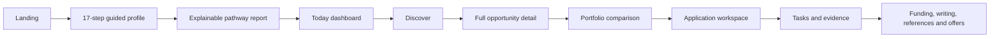

# ScholarPath frontend beta handoff

Status: frontend-complete for backend integration, 31 July 2026.

The frontend can be evaluated end to end without Supabase. Demo mutations remain in client state; the existing hooks and API boundaries switch the same screens to persistent data when Supabase is configured.

## Student journey

## Completed routes

- `/` — landing, guided onboarding, analysis animation and initial pathway report.
- `/today` — evidence overview, deadlines, recommendation flow and priority actions.
- `/discover` — search, filters, sort, saved search and recommendation results.
- `/discover/[id]` — overview, eligibility, funding, timeline and source detail.
- `/portfolio` — portfolio construction and multi-route comparison.
- `/applications` — application list, readiness, requirements, documents, writing, references and activity.
- `/workspace` — Today, Kanban, Calendar and All Tasks execution system.
- `/workspace/documents` — search, categories, upload and file-detail states.
- `/workspace/writing` — evidence outline, editor, word count and save states.
- `/workspace/funding` — cost assumptions, funding gap and scenario states.
- `/workspace/offers` — empty state, offer creation and recorded-offer decision state.
- `/profile` — pathway report, editable profile facts and evidence map.
- `/notifications` — categories, read states and preference navigation.
- `/settings` — personal account and security.
- `/settings/notifications` — channel and event preferences.
- `/settings/privacy` — document access, export, activity and deletion controls.
- `/settings/plan` — beta plan and future billing surface.
- `/help` — searchable guides and correction reporting.
- `/operations` and `/admin` — research and platform operating surfaces.
- `/auth` and `/reference/[token]` — authentication and confidential referee submission.
- Global loading, not-found, route error and global-error states.

## Frontend state behavior

- Demo-mode applications immediately appear after creation.
- Demo-mode document uploads immediately appear in the library.
- Demo-mode writing drafts visibly save.
- Demo-mode offers reveal the completed recorded-offer state.
- Tasks support local creation, movement, evidence confirmation and completion.
- Search, filtering, sorting, comparisons, drawers, modals, tabs and notification read states work without credentials.
- Live mode continues to use the existing Supabase-facing hooks and API routes.

## Backend integration boundaries

| Frontend area | Current boundary | Supabase connection needed |
|---|---|---|
| Authentication | `/api/auth/*` and server client | Auth providers and redirect URLs |
| Profile and onboarding | `/api/assessment` | Persist normalized profile and assessment versions |
| Recommendations | `/api/recommendations` | Populate verified catalogue and atomic rules |
| Applications and workspace | `/api/workspace` | Application and requirement records |
| Execution tasks | `/api/tasks` and `/api/tasks/generate` | Run migration 003 and enable scheduled generation |
| Documents | `/api/documents/*` | Private storage bucket and RLS |
| References | `/api/references/*` | Email delivery and private storage |
| Research operations | `/api/operations` | Source registry, review and publication data |

## Quality checks completed

- Urbanist typography and shared VOIT/Untitled-style design tokens.
- Desktop, tablet and mobile responsive rules for new and existing modules.
- Reduced-motion support.
- Visible keyboard focus treatment.
- Dialog semantics and live status announcements.
- No primary student-facing controls left visually inactive.
- TypeScript validation and optimized Next.js production build.
- Route-level HTTP checks for all public, student, workspace, settings and operations routes.

## Deliberately deferred to backend phase

- Persistent records across devices and sessions.
- Real catalogue records and current official source snapshots.
- Real email, reminder, scheduled-job and notification delivery.
- File malware scanning and document review operations.
- Payment processing; the beta plan is intentionally free.
- Analytics, error monitoring and production environment configuration.

These are backend or operational concerns and do not require a new frontend information architecture.
