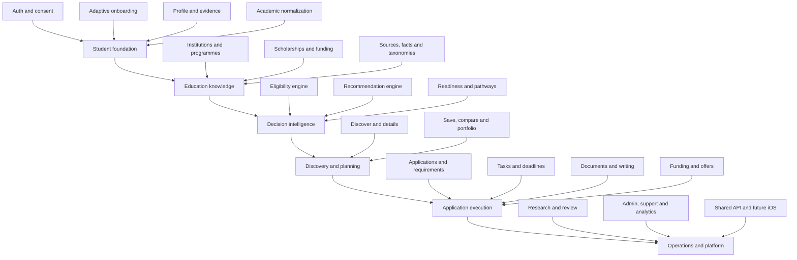
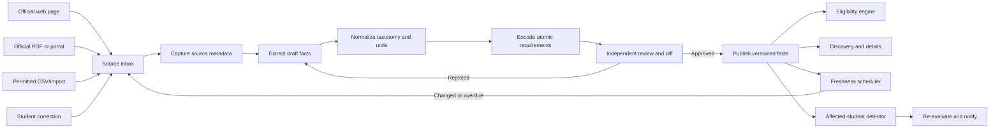
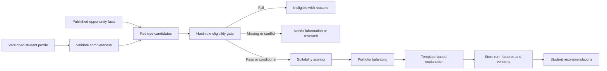

# ScholarPath Complete Education System Map

**Purpose:** One printable view of the complete education product, its internal tools, data flow and recommendation logic.  
**Scope:** Pakistan, India and Bangladesh students pursuing verified foreign education opportunities.  
**Rule:** The 1-2 week beta proves the P0 core; the architecture keeps every later education module intact.

## 1. Are all major modules intact?

**Yes, functionally.** The beta tracker grouped some systems together to stay short; this document exposes the complete product as six connected layers.



## 2. Complete module and feature list

### Layer A - Student foundation

#### A1. Account, identity, consent and security

Controls secure access, privacy and ownership of the student's information.

- Signup, verification, login, recovery, sessions and optional social login
- Student, researcher, reviewer, admin and super-admin permissions
- Consent history, privacy controls, export, deletion and sensitive-access audit

#### A2. Adaptive onboarding and goal capture

Asks only relevant questions and explains why each answer changes the pathway.

- Country-specific branches for Pakistan, India and Bangladesh
- Degree level, destination, intake, subject, budget and funding-need choices
- Dropdowns/taxonomies first, conditional questions, save/resume and answer review
- System suggestions such as missing evidence, realistic intake and prerequisite warnings

#### A3. Student profile and evidence graph

Creates a structured, versioned profile connecting each claim to supporting evidence.

- Personal, academic, language, research, work, project and financial facts
- Strengths, blockers, missing evidence and confidence based on proof actually supplied
- Profile completion by decision value, not a decorative percentage
- Versioned snapshots so every recommendation can be reproduced later

#### A4. Academic context and normalization

Preserves original grades while mapping qualification context for destination rules.

- Original grading scale, marks/GPA, institution, awarding body and completion status
- Pakistan boards/HEC, Indian boards/universities and Bangladesh boards/universities
- Field-of-study and prerequisite taxonomy with transparent equivalency notes
- No silent GPA conversion; unknown equivalence remains unknown or needs review

### Layer B - Verified education knowledge

#### B1. Institution and programme catalogue

Stores institution, programme and intake facts at the correct cycle and campus level.

- University, campus, faculty, programme, level, mode, duration and intake
- Tuition, deposits, application fee, prerequisites, language tests and deadlines
- International-applicant rules, programme status and official application route
- Search facets, aliases, duplicate detection and archived programme versions

#### B2. Scholarship and funding catalogue

Models scholarships independently and connects them to eligible programmes and students.

- Provider, scholarship, cycle, award type, coverage and number/duration of awards
- Origin, residency, degree, field, merit, need, experience and nomination rules
- Separate scholarship/programme application paths and dependency deadlines
- Confirmed, conditional, variable and unknown funding components

#### B3. Source registry and atomic fact store

Makes every consequential claim traceable, reviewable and time-aware.

- Official URL/PDF, owner, locator, excerpt, capture date and effective period
- One source can support many facts; every material fact keeps its own status/version
- Verified, review-due, stale, conflicting, draft and archived states
- Source snapshots/references, correction history and affected-record links

#### B4. Taxonomy and rule library

Provides controlled vocabulary and reusable rule templates across markets.

- Countries, currencies, qualifications, subjects, tests, funding and document types
- Operators for numeric, enum, set, date, evidence and compound conditions
- Origin/destination mappings with provenance and reviewer approval
- Versioned templates; no eligibility logic hidden in UI code

### Layer C - Decision intelligence

#### C1. Deterministic eligibility engine

Decides whether hard rules pass, fail or need information before ranking begins.

- Eligible, conditional, ineligible, missing-information and unknown outcomes
- Atomic rule outcomes with student facts, source facts, reason codes and actions
- Programme and scholarship eligibility evaluated separately, then linked
- Evaluation history, rule-version lock and automatic re-check after a material change

#### C2. Explainable recommendation engine

Ranks viable opportunities and builds a useful portfolio without external AI APIs.

- Structured retrieval, Postgres full-text search and optional pgvector similarity
- Hard eligibility gate before academic, funding, preference and readiness scoring
- Source-confidence and deadline-feasibility penalties
- Portfolio balance across realistic, ambitious, funding-first and needs-research options
- Stored inputs, weights, score components, formula version and explanation templates

#### C3. Readiness report and pathway planner

Turns a profile into gaps, pathways and the next highest-value actions.

- Academic, language, funding, evidence, timing and application-readiness sections
- Strengths, blockers, missing inputs, conditions and improvement opportunities
- Alternative pathway suggestions when the preferred route is blocked
- Change impact: what becomes possible if a test, document or funding gap is resolved

### Layer D - Discovery and portfolio

#### D1. Verified discovery and opportunity details

Lets students search, understand and challenge programme or scholarship information.

- Search, filters, sorting, saved searches, recently viewed and zero-result recovery
- Match state, cost/funding, deadline, conditions, freshness and evidence on each card
- Detailed rules, documents, application steps and official source panel
- Report incorrect information at the exact fact, not through a generic complaint box

#### D2. Saved opportunities, compare and portfolio

Converts browsing into a deliberate and financially realistic shortlist.

- Save, notes, tags, groups, priority and decision status
- Compare 2-4 items across academic, funding, deadline, evidence and risk dimensions
- Portfolio concentration, affordability, deadline collision and missing-evidence warnings
- Recommendation history and visible explanation when an item's position changes

### Layer E - Application execution

#### E1. Application workspace and requirement matrix

Turns an opportunity version into a trackable application with evidence-backed readiness.

- Considering through submitted, result, offer, withdrawn and closed states
- Required, conditional, optional, unknown and not-applicable requirements
- Readiness review, blockers, submission reference and submitted evidence snapshot
- Scholarship dependencies linked to the correct programme application

#### E2. Tasks, calendar and deadlines

Generates the next action from requirements instead of relying on manual to-do lists.

- Today, upcoming, blocked, waiting, overdue and completed views
- Owner, due date/timezone, dependency, reminder and completion evidence
- System-generated tasks with visible source/rationale and student editing
- Deadline changes keep history and notify affected students

#### E3. Document vault and requirement linking

Stores private documents once while tracking acceptance separately per application.

- Passport, transcript, degree, test, CV, financial, research and submission files
- Upload, preview, version, expiry, replace, archive and secure download
- Metadata confirmation, requirement linking and reuse without duplicating files
- Missing, uploaded, needs-review, accepted, rejected and expired states

#### E4. Writing and recommender workspace

Supports authentic drafting and reference coordination without auto-writing final submissions.

- Prompt breakdown, evidence bank, outline, draft versions and word-limit checks
- Application-specific claim/evidence checklist and export
- Recommender invite, instructions, deadline, reminders, replacement and receipt tracking
- Private recommendation content is never exposed to the student or an AI service

#### E5. Funding, ROI, offers and decisions

Shows affordability and trade-offs using editable assumptions rather than fake certainty.

- Tuition, living costs, travel, insurance, fees, deposits and currency assumptions
- Confirmed/conditional funding, personal contribution and remaining gap
- Scenario comparison, first-year cash need and sensitivity ranges
- Offer conditions, response deadlines, deposits, refund terms and decision record

### Layer F - Operations and platform

#### F1. Research intake, review and publication

Gives operators a controlled workflow for turning official material into product truth.

- Source inbox, capture form, structured extraction, duplicate check and normalization
- Atomic fact/rule editor with source shown beside every field
- Independent reviewer, before/after diff, rationale and publication scheduling
- Freshness calendar, conflict queue, correction queue and rollback/version history

#### F2. Administration, support and analytics

Runs access, content quality and student support without exposing unnecessary personal data.

- Users, roles, support tickets, correction tickets, notification templates and feature flags
- Audit log, security events, job failures and elevated-access reasons
- Funnel, recommendation quality, source freshness and deadline-prevention analytics
- No counselor marketplace, paid lead selling or hidden sponsored ranking

#### F3. Notifications and change impact

Delivers useful alerts when verified information or execution state changes.

- Deadline, requirement, source, document, recommender, support and security events
- In-app/email preferences, quiet rules, retries and delivery history
- Changed facts identify affected saves/applications before notification
- Every alert links to the changed fact and required action

#### F4. Shared API, web and future iOS

Keeps one set of business rules behind every current and future client.

- Versioned `/v1` contracts for profile, catalogue, eligibility, recommendations and applications
- Web app and future iOS app call the same domain services
- OpenAPI, validation, authorization, rate limits, idempotency and audit records
- MCP can be added later as a read-only adapter; it never owns product logic

## 3. Main technical tools and how each helps

| Tool | Job in ScholarPath | Why it fits now |
|---|---|---|
| Next.js + TypeScript | Web app, server routes and admin surfaces | One codebase, fast beta and shared types |
| Vercel | Host web and preview deployments | Free beta hosting is sufficient initially |
| Supabase Pro Postgres | Core relational data and versioned records | Already purchased; strong relational/RLS foundation |
| Supabase Auth | Accounts, sessions and role claims | Integrates directly with RLS |
| Supabase Storage | Private student documents and source files | Signed URLs and bucket policies |
| Postgres FTS + trigram | Programme/scholarship search | No paid search service required for beta |
| pgvector, optional | Semantic candidate retrieval | Runs inside Supabase; not a decision engine |
| Zod | Validate forms, APIs, imports and rule payloads | Prevents malformed data entering engines |
| Supabase Cron/Edge Functions | Freshness checks and background jobs | Keeps scheduled work close to the database |
| React Email + SMTP provider | Account and deadline emails | Templates remain in our code; provider only delivers |
| Vitest | Rule, scoring and service tests | Fast deterministic regression suite |
| Playwright | End-to-end student/admin flows | Proves the real beta loop in browsers |
| GitHub Actions | Type, lint, test and deployment gates | Stops broken rules or migrations reaching beta |
| Sentry, optional | Runtime errors and performance | Useful during beta; never store sensitive documents |
| Product analytics, privacy-safe | Funnel and failure events | Measure outcomes, not time-wasting engagement |

**No runtime AI API is required.** Codex helps build the system; production eligibility, ranking, reports and status checks run through our code, database rules and approved templates.

## 4. Where the data comes from

| Data | Primary source | Intake method |
|---|---|---|
| Programmes and admissions | Official institution programme/admissions pages and regulations | Researcher capture, structured form and permitted file import |
| Scholarships | Official funder, government, university or consortium pages | Researcher capture by scholarship cycle |
| Deadlines and documents | Official application portals, instructions and downloadable PDFs | Manual verification plus structured extraction |
| Market discovery | UCAS, DAAD, Erasmus catalogue and EducationUSA-type official discovery sources | Leads only; verify against the owning institution/funder |
| Qualification context | Official boards, regulators and recognized institutional policies | Reviewed taxonomy/equivalency records |
| Student facts | Student entries and uploaded evidence | Guided onboarding and profile updates |
| Progress/status | Student actions and system events | Application, task, document and notification event logs |
| Product improvement | Corrections, recommendation feedback and eventual outcomes | Structured feedback with consent and audit history |

For beta, data does **not** arrive through a magical scholarship API. We manually build a narrow, high-quality catalogue from official sources, then automate freshness and permitted imports only after the truth workflow is reliable.

## 5. Data intake and processing diagram



### Processing rules

- Extraction creates a draft only; it can never publish automatically.
- A material fact needs an official source, effective date and a second-person review.
- Facts are versioned instead of overwritten, so past recommendations remain reproducible.
- Conflicting sources stay visible to operators and become unknown for students until resolved.
- Freshness intervals depend on volatility: deadlines more often, stable institutional facts less often.

## 6. Recommendation processing diagram



### Recommended V1 scoring shape

```text
ranking_score =
  academic_fit       * 0.30 +
  funding_fit        * 0.25 +
  preference_fit     * 0.15 +
  deadline_readiness * 0.15 +
  evidence_confidence* 0.15
```

- Weights are starting hypotheses, not universal truth; validate them against golden profiles.
- Hard rules never become soft score bonuses.
- Unknown data reduces confidence rather than inventing a pass or fail.
- The explanation is assembled from rule outcomes and source-backed facts, not an LLM.
- Later learning-to-rank can reorder eligible items only after reliable outcome data and fairness review.

## 7. Complete student journey

```mermaid
flowchart LR
    A["Create account"] --> B["Adaptive profile"]
    B --> C["Readiness report"]
    C --> D["Verified recommendations"]
    D --> E["Explore details"]
    E --> F["Save and compare"]
    F --> G["Build balanced portfolio"]
    G --> H["Create application"]
    H --> I["Requirements and tasks"]
    I --> J["Documents, writing and references"]
    J --> K["Readiness review"]
    K --> L["Student submits externally"]
    L --> M["Track result and offer"]
    M --> N["Compare funding and decide"]
```



ScholarPath supports preparation and progress; it does not submit on the student's behalf or sell consultant access.

## 8. Older-project education features: keep, improve or remove

| Older feature | ScholarPath decision | Better implementation |
|---|---|---|
| Signup/login and role dashboards | Keep | Supabase Auth, RLS, consent and audited roles |
| Long onboarding assessment | Keep and redesign | Adaptive regional questions, dropdowns and saved drafts |
| Profile DNA | Keep concept | Evidence graph and readiness signals; remove speculative personality claims |
| Free summary and premium report | Keep concept | Source-backed readiness report with gaps and pathways |
| Analyzing screen | Keep only as honest processing | Real job state; no fake progress animation |
| University knowledge base | Keep and deepen | Institution/programme/intake model with sources and versions |
| Scholarship discovery and deadlines | Keep and deepen | Scholarship cycles, funding components and separate eligibility |
| Study-abroad matcher | Keep and replace engine | Hard rules, explainable scoring and portfolio balance |
| Recommendations and history | Keep | Reproducible runs with profile/rule/data versions |
| Save and comparison labs | Keep and unify | One portfolio for programmes and linked scholarships |
| Command center/dashboard | Keep and simplify | Today view driven by deadlines, blockers and next actions |
| Journey and action plan | Keep and deepen | Application state machine, requirement matrix and generated tasks |
| Execution workspace | Keep | Applications, deadlines, documents, writing and submission record |
| Document vault | Keep and deepen | Secure versions, expiry and per-requirement acceptance |
| AI document generation | Restrict | Evidence-led drafting tools; no auto-final SOP/LOR |
| ROI calculator | Keep carefully | Editable cost/funding scenarios, not promised salary outcomes |
| Dashboard profile/history | Keep | Profile snapshots, recommendation history and change explanations |
| Admin universities/scholarships/content | Keep and rebuild | Source-first research CMS with independent review and diffs |
| Admin recommendation weights | Keep with controls | Versioned configuration, approval, tests and rollback |
| AI training/monitoring console | Remove for V1 | Rule quality, source health and regression monitoring instead |
| Support/admin activity | Keep | Minimal-data support, correction workflow and full audit trail |
| Pricing/billing | Later | Add only after beta value and entitlement boundaries are proven |
| Visa-risk prediction | Remove | Later official study-visa checklist only; never refusal probability |
| Counselors/community/jobs/migration | Remove from product | Separate future products, not ScholarPath education scope |

## 9. Improvements the older project did not properly contain

- Atomic source-backed facts, provenance, effective dates and independent approval
- Explicit unknown/conflicting states instead of invented confidence
- Origin qualification context for Pakistan, India and Bangladesh
- Separate programme and scholarship eligibility with dependency mapping
- Profile snapshots and fully reproducible recommendation runs
- Source-change impact detection, automatic re-evaluation and targeted alerts
- Golden profiles, rule tests, ranking regression and subgroup fairness checks
- Requirement matrix, submission evidence snapshot and document acceptance per application
- Fact-level corrections, freshness calendar and operational quality dashboards
- One shared service layer for the web beta and future iOS app

## 10. Beta boundary versus complete system

### Must work in the 1-2 week beta

- Auth, regional profile, 10 reviewed opportunities and source-backed detail pages
- Deterministic eligibility, initial ranking, explanations, save and compare
- Basic application case, requirements, tasks and minimal private document upload
- Research/source/review admin, RLS, audit, feedback and correction intake

### Designed now, completed after beta evidence

- Full writing/recommender workflows, advanced funding/offers and saved-search alerts
- Rich notification automation, full document lifecycle and advanced analytics
- Larger catalogue, permitted ingestion automation and learning-to-rank
- Native iOS client after the shared web contracts and workflows stabilize

## 11. Non-negotiable technical principles

- Official sources create product truth; aggregators only help discovery.
- Rules decide eligibility; scores rank only viable choices.
- Unknown is a valid result and is safer than false certainty.
- No external AI dependency is required for the production decision system.
- Supabase is sufficient for beta and early production; Hostinger is unnecessary now.
- The UI must reveal evidence, conditions and next actions without looking like an admin panel.
- Every important decision must be reproducible, testable and correctable.
