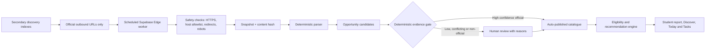

# CandidRoute product status

Updated: 14 August 2026

Verdict: the product shell, protected admin area and Supabase-backed official-source pipeline are live. High-confidence official scholarships now publish automatically; the catalogue is still not broad enough for a best-in-class recommendation engine.

## Current truth

- The old beta date is no longer the operating plan. We are now building toward a complete product.
- The duplicate loading experience was caused by a global green gradient loading screen. It has been replaced with a neutral top progress bar.
- The "two admin interfaces" issue was caused by staff navigation mixing `/operations` with `/admin`. The Super Admin nav now stays inside `/admin`, and `/operations` redirects admins to `/admin?tab=review`.
- Local build, typecheck and tests pass.
- Supabase is connected, migrations are live, and the ingestion Edge Function is deployed.
- The source network now contains 405 records. Opportunities Circle and Scholarpath.world are used only to discover official URLs; their prose and images are ignored. Five historical URL aliases are archived and there are zero active normalized URL duplicate groups. Published catalogue breadth and review throughput remain incomplete.

## Module status

| Module | Status | Done now | Missing now |
|---|---|---|---|
| Design system and shell | Partial | Urbanist shell, light admin overrides, duplicate loader fix | Founder UX sign-off, mobile browser pass, final interaction polish |
| Auth and roles | Partial | Supabase auth, admin role, guarded admin routes | Recovery email journey, redirect QA, two-user isolation proof |
| Student profile | Partial | Profile flow and validation structure exist | Signed-in save acceptance, stronger dropdown datasets, profile completeness scoring |
| Student report | Partial | Report UI concept and pathway sections exist | Live sourced report from published catalogue, evidence impact explanations |
| Recommendation engine | Partial | Deterministic eligibility flow and explainability direction exist | Broad published data, golden-profile regression, ranking weights, fairness checks |
| Task and deadline system | Partial | Task/Kanban UI direction exists | Live generated tasks from missing evidence, impact scoring, deadline reminders |
| Opportunity ingestion | Partial | 405+ sources, daily discovery, normalized URL deduplication, exact-host crawling, snapshots and deterministic auto-publication | Expand structured eligibility/funding extraction and catalogue breadth |
| Admin command center | Partial | Protected Super Admin command center with source/review/run tabs | Cleaner admin-only IA, reviewer workflow polish, signed-in browser acceptance |
| Country intelligence | Partial | Schema/UI direction exists | Full country profiles: costs, visa, work rights, safety, healthcare, halal/community, salaries |
| Institution directory | Partial | Directory UI/database plus daily ROR identity enrichment; 12/12 current institutions uniquely matched | Broader production university catalogue, campuses, courses, intakes and entry equivalence |
| Rankings | Not started | Product decision: rankings are context only | Ranking tables, source/licensing decision, ranking history |
| Deployment and monitoring | Partial | Public Vercel deployment and Supabase backend are active | Monitoring, error capture and backup/rollback proof |
| Security hardening | Partial | RLS/auth structure and protected APIs exist | Supabase advisor cleanup, leaked password protection, formal role-isolation test |

## Opportunity data pipeline

## Source coverage status

| Source area | Status | Notes |
|---|---|---|
| Opportunities Circle | Live discovery | Daily public WordPress feed; 100 detail routes seeded; only official outbound URLs are retained |
| Scholarpath.world | Live discovery | Daily public JSON feed; 75 scholarship application URLs found; descriptions and images ignored |
| EACEA/Erasmus catalogue | Live partial | 220 discovery leads captured; secure leads can be adopted, but not auto-published |
| Chevening, DAAD, Ireland, Netherlands, Leeds, Saarland, Trinity | Live partial | Detail sources exist and need structured enrichment/review |
| Commonwealth Scholarships | Ready to add | Official source verified; needs source pack and parser |
| Australia Awards | Ready to add | Official source verified; needs source pack and parser |
| MEXT Japan | Ready to add | Official source verified; needs source pack and parser |
| Turkiye Scholarships | Ready to add | Official source verified; needs source pack and parser |
| Stipendium Hungaricum | Ready to add | Official source verified; needs source pack and parser |
| EduCanada scholarships | Ready to add | Official source verified; needs source pack and parser |
| Fulbright country portals | Ready to add | Official programme exists; country-specific sources need mapping |
| Korea GKS / Study in Korea | Ready to add | Official source verified; needs source pack and parser |
| Manaaki New Zealand | Candidate | Official portal identified; needs parser and policy check |
| IsDB scholarships | Candidate | Official portal identified; needs parser and policy check |

## API decision

- ROR v2: active now for global institution identity, domains, locations and external IDs; it never supplies admission or scholarship eligibility truth.
- CareerOneStop: selected for additional US scholarship discovery, but activation requires its free registered user ID and API token.
- College Scorecard: use later for US institution costs/outcomes only.
- Opportunities Circle and Scholarpath.world: discovery indexes only; CandidRoute follows their links and stores facts from official provider pages without copying their images or descriptions.

## What blocks a complete product

1. The published catalogue is still too small for serious recommendations even though official-source discovery and high-confidence auto-publication are live.
2. Candidate records need structured fields before they can influence eligibility.
3. The review-to-publish workflow needs a signed-in admin acceptance pass.
4. Country intelligence and institution directory need production data, not demo coverage.
5. Recommendation quality cannot be called best-in-class until golden profiles pass regression tests.
6. Security advisors and auth recovery/redirect flows need final hardening.
7. Vercel production deployment and monitoring are not proven yet.

## Build order from here

1. Finish the admin-only source command center and remove remaining confusing student/staff overlap.
2. Add the global official source pack migrations and parsers.
3. Convert candidates into structured review drafts with required fields.
4. Publish a useful starting catalogue across UK, US, Canada, Australia, Europe, Japan, Korea, Turkiye and Islamic-bank funded routes.
5. Connect published opportunities to recommendation scoring, report generation and task impact.
6. Run UX acceptance on desktop and mobile.
7. Deploy on Vercel with Supabase production environment values and monitoring.

## Verification

- `npm run build`: passed.
- `npm run typecheck`: passed after build generated `.next/types`.
- `npm test`: passed, 29 tests.

## Scholarship publication automation — 14 August 2026

- High-confidence exact-official candidates now publish without daily admin approval; a score of 80 plus all safety gates is required.
- Low-confidence, conflicting, expired, insecure and secondary-index records remain in human review with explicit reasons.
- Current acceptance: 3 automatically published candidates, 6 total published scholarships and duplicate application URLs blocked.
- Verification: 47/47 migration parity, zero linked schema-lint errors, successful production build and 29/29 passing tests.
