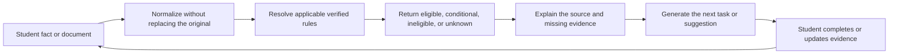
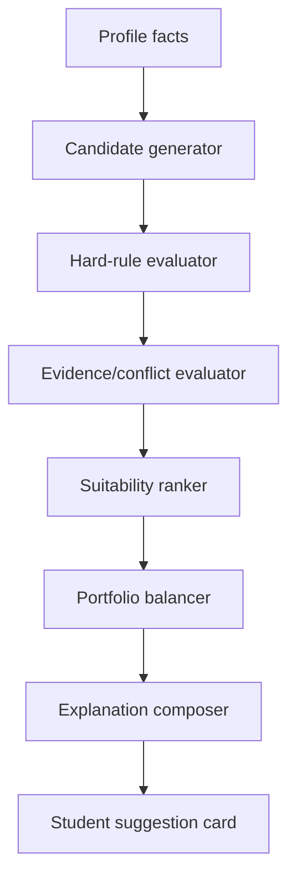
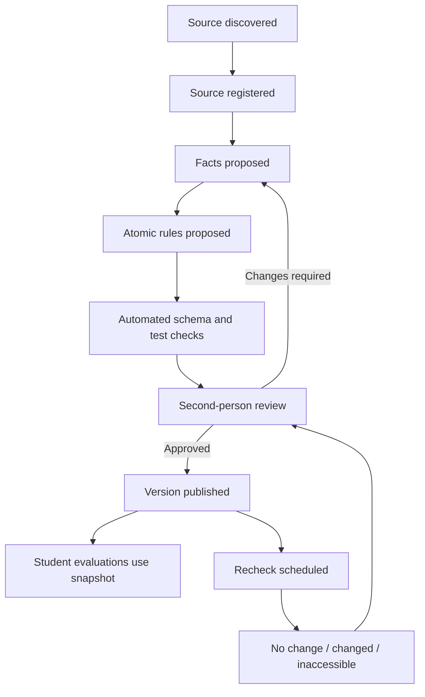
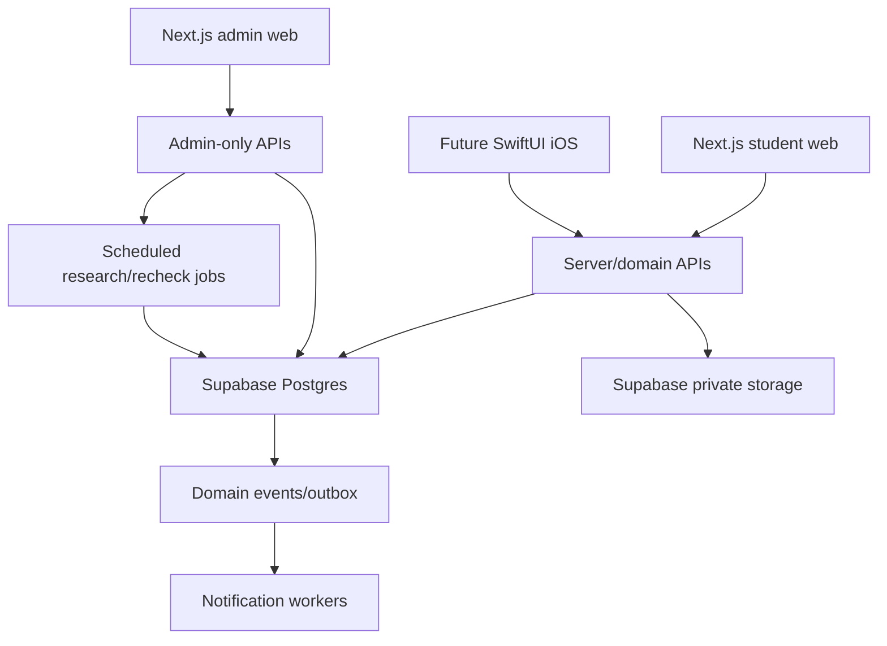

# ScholarPath System Operating Blueprint V2

## Research-first product specification

Status: founder review draft  
Product: scholarship and foreign-university application execution system  
Primary students: Pakistan, India, and Bangladesh  
Initial degree focus: taught master’s programmes  
Constraint: no external AI API is required for core matching, checks, suggestions, or status generation  
Technology direction: Next.js web application, Supabase/Postgres backend, and a future SwiftUI iOS client  

---

## 1. Executive correction

The present assessment is a useful interaction prototype, but it is not yet a
trustworthy student-record system. It currently asks the student to type values
that the product should constrain, derive, or verify. Its country-fit scores are
directional placeholders and must not become the production matching model.

The production system should behave as a **guided evidence and execution
engine**, not a long questionnaire and not a digital consultant.

It should:

1. collect the minimum fact needed to open the next relevant branch;
2. derive what can be derived from controlled taxonomies and verified sources;
3. show the student what the system understood;
4. identify missing, contradictory, or unverified evidence;
5. suggest the next answer, pathway, or task with a visible reason;
6. evaluate opportunities only against versioned official rules;
7. preserve every source, rule version, assumption, and decision trace;
8. help the student execute the work without pretending to submit on their
   behalf or guarantee an outcome.

The core product loop is:



The product’s defensible advantage is not a large list of scholarships. It is
the traceable chain from **official source → structured rule → student fact →
explainable result → executable next action**.

---

## 2. Critical scope recommendation

### 2.1 Start narrow

The first trustworthy release should cover:

- applicants from Pakistan, India, and Bangladesh;
- taught master’s programmes;
- one primary intake window at a time;
- United Kingdom, Germany, and Erasmus Mundus routes;
- a small set of flagship scholarships with meaningfully different workflows;
- self-funded and mixed-funded programme pathways, not only fully funded awards.

The first scholarship set should contain approximately 10 representative
opportunities, not hundreds of shallow records:

- Chevening;
- Commonwealth Master’s;
- Commonwealth Shared where a live course list is available;
- Erasmus Mundus programmes from several consortia;
- DAAD EPOS or another clearly documented DAAD family;
- USEFP Fulbright for Pakistan;
- Fulbright-Nehru Master’s for India;
- one Bangladesh government-nominated route;
- two university-specific awards with programme-level dependencies.

### 2.2 Do not make Canada the first deep rule market

Canada can appear as a research lane, but it should not be a launch-critical
eligibility market. Its DLI, programme, post-graduation-work-permit, attestation,
and study-permit rules require frequent re-verification. The current official
DLI list now distinguishes PGWP-eligible institutions and public graduate
programmes with specific attestation treatment. This is operationally valuable,
but volatile.

### 2.3 Separate three products inside one system

ScholarPath contains three connected systems:

1. **Truth system** — sources, catalogue, rules, versions, and verification.
2. **Decision system** — profile interpretation, eligibility, suitability, and
   recommendation reasons.
3. **Execution system** — portfolio, tasks, documents, writing, references,
   submissions, offers, and progress.

They share data, but each has different permissions, tests, and failure modes.

---

## 3. User roles

### 3.1 Student

- owns profile facts, documents, preferences, and application states;
- confirms system-derived facts;
- completes external applications personally;
- can dispute a rule interpretation or report stale information.

### 3.2 Research operator

- discovers official sources;
- creates proposed catalogue facts and atomic rules;
- cannot publish high-impact rules alone.

### 3.3 Reviewer

- checks proposed facts against sources;
- resolves or records contradictions;
- approves, returns, or rejects a publication.

### 3.4 Administrator

- manages roles, taxonomies, source schedules, support, and incidents;
- does not bypass row-level security through a client-side flag.

### 3.5 System

- derives structured facts;
- chooses the next relevant question;
- evaluates deterministic rules;
- creates suggestions, warnings, deadlines, and tasks;
- never silently changes a student fact or claims a guaranteed outcome.

---

## 4. Smart onboarding and profile system

## 4.1 Onboarding objective

Onboarding should produce a usable **Profile Snapshot**, not a complete lifetime
biography. A student should reach first value in approximately five minutes,
then progressively complete evidence when a saved opportunity requires it.

The first-value profile needs:

- citizenship and residence;
- current academic stage and highest relevant qualification;
- institution and awarding body;
- original grading system and result;
- intended level and field family;
- intended intake window;
- language-test state;
- work/research state where relevant;
- funding dependency and usable financial range;
- location constraints and route exclusions.

It does not initially need every award, volunteer activity, publication, or
document. Those belong in progressive profile modules triggered by opportunity
requirements.

## 4.2 Control-selection rule

The interface should not blindly replace all text fields with dropdowns.

| Number/type of choices | Preferred control | Reason |
|---|---|---|
| 2 options | radio cards or segmented control | all choices remain visible |
| 3–6 options | radio/choice cards | faster recognition than opening a menu |
| 7–15 stable options | select or native picker | compact but still scannable |
| more than 15 options | searchable combobox | avoids long scrolling |
| hierarchical taxonomy | searchable grouped combobox | preserves parent/child meaning |
| multi-select under 12 | chips or check cards | visible selection state |
| large multi-select | searchable list with selected tray | prevents an oversized chip cloud |
| bounded number | numeric input, stepper, or slider based on precision | menus are poor for numeric entry |
| unknown or unlisted value | “Not listed” branch with review state | prevents forced wrong classification |

The U.S. Web Design System recommends comboboxes for long option lists but also
warns that they require careful accessibility and user testing. Every
ScholarPath combobox therefore needs a visible label, keyboard support, screen
reader announcements, escaped cancellation, and no automatic form submission.

## 4.3 Current prototype field audit

| Current field | Problem | Production control | System involvement |
|---|---|---|---|
| First name | acceptable for friendly display but not legal identity | short text | later distinguish preferred name from passport name |
| Nationality | only one of three visible cards | searchable country picker with Pakistan, India, Bangladesh pinned; allow multiple citizenships | set origin rule branches and scholarship-country routes |
| Current country | free text creates spelling variants | ISO country combobox | prefill from locale only as a suggestion; student confirms |
| Study level | correct as cards | visible level cards | remove levels unavailable for the selected launch scope |
| Latest qualification | unstructured and unusable for rules | country-dependent qualification combobox | derive framework level, typical duration, and possible grading schemes |
| Institution | absent | searchable recognized-institution combobox | show recognition source and “not found” review path |
| Awarding body | absent | conditional combobox | ask only when different from teaching institution |
| Field of study | free text prevents stable matching | hierarchical ISCED-based combobox with local aliases | map local programme title to a stable field code while preserving original title |
| Grade scale | asks student to classify technical metadata | system-selected scheme with correction option | derive from institution/qualification; never overwrite original transcript representation |
| Grade value | generic 0–100 validator conflicts with CGPA scales | schema-aware numeric control | set min, max, decimal precision, class/division fields, and validation from selected scheme |
| Graduation year | free numeric entry | year picker plus completion status | distinguish completed, final-year, result-awaited, and expected completion |
| English status | useful visible cards | cards retained | trigger test-specific follow-up only when relevant |
| English score | hard-coded as IELTS-equivalent | test picker plus component-score schema | calculate expiry, missing component, and programme-specific shortfall |
| Experience years | loses overlapping roles and scholarship hour rules | repeatable employment/volunteer/internship records | calculate months and eligible hours per scholarship rule |
| Research yes/no | too coarse | structured research evidence selector | distinguish thesis, assistantship, paper, poster, publication, proposal, and no evidence |
| Target countries | forces the student to know the answer before analysis | preference and exclusion controls plus “show me suitable routes” | system proposes lanes after constraints; student can still pin preferences |
| Intake | free text creates date ambiguity | season/month and year picker | map to programme intakes and calculate preparation runway |
| Budget in USD | ignores local currency, timing, and source | local-currency amount, source, availability date, annual/total scope | convert only for planning with timestamped exchange-rate assumptions; keep original |
| Funding need | useful cards but underspecified | coverage-level cards plus maximum personal contribution | separate tuition, living, travel, visa, tests, and application costs |
| Weekly hours | useful slider | slider or stepper retained | convert deadlines and dependencies into a realistic weekly plan |
| Biggest blocker | useful cards | visible choices retained | select the dashboard’s first intervention and help content |

## 4.4 Country-dependent academic capture

The qualification and institution lists must be controlled by the origin
country and education stage.

### Pakistan

Use HEC’s recognized institutions and Pakistan Qualification Register as the
primary higher-education references. PQR contains quality-assured
qualifications, providers, qualification levels, credit-hour context, and
subject classifications. Programme accreditation may additionally depend on
professional councils.

Example branch:

```text
Pakistan
  → Higher education
    → Recognized institution
      → Campus/college
        → Qualification title
          → Completion state
            → Institution grading scheme
              → Original result and evidence
```

### India

Use UGC institution records and the National Higher Education Qualifications
Framework as top-level references, with professional regulators where a
programme requires them. The system must support three-year and four-year
bachelor’s structures because destination and scholarship rules may treat them
differently.

### Bangladesh

Use the Bangladesh UGC university lists and published programme information.
Bangla and English aliases should map to the same internal identifier. An
unlisted institution or programme must become “unverified,” not an automatic
failure.

## 4.5 Field-of-study taxonomy

Use UNESCO ISCED-F 2013 as the neutral global parent taxonomy. Store:

- original programme/major text from the student;
- selected ISCED broad, narrow, and detailed field;
- local aliases;
- scholarship-specific eligible-field mapping;
- programme-specific subject prerequisites separately.

The taxonomy is for search and rule routing. It must not imply that two degrees
with the same field code have equivalent curricula.

## 4.6 System-involvement moments

The onboarding should provide small, evidence-based interventions:

1. **After origin and level:** “We will use the Pakistan qualification branch
   and HEC-recognized institution list.”
2. **After qualification:** show the framework level, typical duration, and
   unresolved recognition status.
3. **After grading scheme:** show exactly how the result will be stored; do not
   show an invented foreign GPA.
4. **After target field:** suggest adjacent controlled fields only when the
   student’s title maps ambiguously.
5. **After language state:** show which test details are still needed and why.
6. **After work history:** calculate reusable totals and scholarship-specific
   eligible totals separately.
7. **After budget:** identify cost components not yet covered; do not immediately
   label the student “unaffordable.”
8. **After core profile:** propose pathway lanes with reason codes, confidence,
   and missing evidence.

Every intervention needs one of these labels:

- **Derived from your answers**
- **Verified requirement**
- **Planning assumption**
- **Suggestion**
- **Needs confirmation**

---

## 5. Deterministic suggestion system

## 5.1 Why this is not an AI chatbot

The core suggestion engine can run entirely on our own backend:

- Postgres full-text search for catalogue discovery;
- trigram search for misspellings and aliases;
- controlled taxonomies for fields, qualifications, documents, and goals;
- versioned deterministic rules for eligibility;
- transparent ranking weights for suitability;
- templates for next actions and explanations;
- event-driven recalculation when a relevant fact changes.

No external generative AI is needed for eligibility, status, matching, or task
generation.

## 5.2 Suggestion pipeline



### Candidate generator

Uses degree level, field taxonomy, citizenship, intake, delivery language, and
basic availability to produce a broad set.

### Hard-rule evaluator

Returns:

- eligible;
- conditionally eligible;
- ineligible;
- unknown because evidence or a rule is missing;
- not currently open.

### Suitability ranker

Ranks only candidates that survive hard-rule evaluation. It may use:

- funding coverage;
- total estimated cost;
- time runway;
- language readiness;
- document workload;
- research/taught preference;
- location and delivery preferences;
- application fee;
- portfolio diversification.

Suitability is not admission probability.

### Portfolio balancer

Prevents ten near-identical high-risk applications. It should show:

- ambitious;
- aligned;
- lower-cost;
- scholarship-dependent;
- admission-first;
- backup;
- excluded with reason.

## 5.3 Suggestion object

Every suggestion should store:

```text
suggestion_id
student_id
type
subject_type
subject_id
generated_at
expires_at
input_snapshot_id
rule_snapshot_id
reason_codes[]
evidence_used[]
assumptions[]
blocking_gaps[]
confidence
student_response
```

Student responses—saved, hidden, not relevant, already done—improve product
ordering but must not alter eligibility rules.

---

## 6. Module-by-module operating design

## Module A: Account, identity, consent, and recovery

### Student experience

- explore a guest preview before account creation;
- create an account when saving a report or opportunity;
- verify email;
- optionally use Sign in with Apple in the iOS app;
- view active sessions;
- export or delete the account.

### System responsibilities

- separate authentication identity from student profile;
- store consent version and timestamp;
- require MFA for administrators;
- keep account deletion and legal retention workflows explicit.

### P0 boundary

Email/password or magic link, verified email, password recovery, student role,
admin role assignments, consent records, and account deletion request.

---

## Module B: Student profile and evidence graph

### Student experience

- progressive interview rather than one long form;
- “known, missing, needs confirmation” profile states;
- multiple qualifications, roles, tests, and citizenships;
- profile completeness changes by selected opportunity;
- uploaded evidence can support a claim but never silently rewrite it.

### System responsibilities

- preserve original values;
- connect facts to evidence;
- track who asserted or derived each fact;
- retain change history;
- recalculate only affected rule results.

### Key states

`asserted`, `derived`, `document_supported`, `verified`, `disputed`,
`superseded`, `unknown`.

---

## Module C: Academic context and normalization

### Student experience

- choose recognized institution and qualification;
- see framework level and source;
- enter the result exactly as issued;
- see any destination-specific published equivalency;
- see “institution confirmation required” when no official equivalency exists.

### System responsibilities

- never convert every result to a universal GPA;
- apply programme or university country-specific rules before general rules;
- store education years, duration, credits, class/division, and grading notes;
- detect inconsistent combinations.

### Failure handling

An institution not found or a nonstandard transcript creates a manual-review or
unknown state. It does not create an automatic ineligible result.

---

## Module D: Goals, constraints, and pathway planning

### Student experience

- describe desired field, degree, career direction, and intake;
- state must-haves and exclusions;
- state funding dependency and timing;
- allow the system to suggest countries rather than forcing country selection.

### System responsibilities

- turn preferences into soft constraints;
- keep hard exclusions separate;
- show conflicts such as “fully funded only” plus “start in four months”;
- recommend preparation or deferral when the timeline is unrealistic.

---

## Module E: University and programme catalogue

### Student experience

- search and filter programmes;
- see institution recognition, delivery language, duration, intake, costs,
  application channel, and source freshness;
- compare a small number side by side;
- save to a portfolio.

### System responsibilities

- separate institution, campus, programme, and intake;
- separate programme facts from scholarship facts;
- retain official programme URL and verification date;
- never infer missing tuition or entry requirements from another programme.

### UX benchmark conclusion

Use Coursera’s compact result density and filter pattern as inspiration, but add
eligibility status, funding dependency, freshness, and source evidence. Filters
should show active chips and result-count impact before application.

---

## Module F: Scholarship and funding catalogue

### Student experience

- find scholarships by citizenship, degree, field, funding component, and
  application route;
- see current cycle and previous-cycle history;
- distinguish direct, university, consortium, and nominating-body workflows;
- see exactly what “funded” covers.

### System responsibilities

- separate scholarship programme from annual cycle;
- model tuition, stipend, travel, visa, insurance, and other components;
- model parallel applications and deadlines;
- archive expired cycles without deleting evidence.

### Critical examples

- Chevening requires an eligible citizenship/residence branch, post-degree work
  experience totals, three eligible course choices, and later an unconditional
  offer.
- Commonwealth Master’s requires the central CSC application and a nominator
  route that may add criteria and an earlier deadline.
- Erasmus Mundus applications are programme/consortium-specific; the central
  catalogue is not the application destination.
- USEFP Fulbright and Fulbright-Nehru have different degree, experience, field,
  placement, and test structures despite sharing the Fulbright name.

---

## Module G: Source registry, data intake, and verification

### Operator experience

- register a source;
- capture proposed facts;
- convert requirements into atomic rules;
- attach source ranges or sections;
- send for review;
- publish with an effective date and next review date;
- inspect change alerts and contradictions.

### System responsibilities

- enforce source hierarchy;
- prevent high-impact self-publication;
- schedule rechecks;
- calculate freshness;
- preserve source snapshots where lawful;
- block eligibility publication when the supporting source is missing.

### Publication states

`draft`, `in_review`, `verified`, `verified_with_ambiguity`,
`needs_recheck`, `expired`, `withdrawn`, `archived`.

---

## Module H: Eligibility and rule engine

### Rule structure

Each atomic rule needs:

```text
subject
operator
expected_value
unit_or_taxonomy
scope
effective_from
effective_to
source_id
source_location
severity
missing_evidence_behavior
version
review_status
```

### Operators

`equals`, `not_equals`, `in`, `not_in`, `greater_than`,
`greater_or_equal`, `less_than`, `less_or_equal`, `between`,
`exists`, `not_exists`, `count_at_least`, `duration_at_least`,
`hours_at_least`, `date_before`, `date_after`, and approved composite groups.

### Evaluation order

1. confirm the opportunity cycle is open or upcoming;
2. select rule versions effective for that cycle;
3. resolve rule precedence;
4. test hard rules;
5. test evidence completeness;
6. test conditional requirements;
7. calculate suitability separately;
8. produce a trace and next actions.

### Non-negotiable output

The student must be able to open “Why?” and see:

- the profile fact used;
- the rule;
- the official source;
- the verification date;
- the result;
- how to correct or complete the evidence.

---

## Module I: Readiness report and application portfolio

### Student experience

- see readiness by evidence domain rather than one unexplained score;
- see suitable, conditional, unknown, and excluded routes;
- save opportunities into a balanced portfolio;
- see workload and deadline collisions;
- see what changed since the previous report.

### System responsibilities

- separate readiness, eligibility, suitability, and confidence;
- create a versioned report snapshot;
- never show fake scholarship probability;
- identify the smallest set of facts that could materially change a result.

### Recommended report domains

- academic evidence;
- language;
- experience/leadership;
- research;
- documents;
- funding;
- timeline;
- portfolio balance.

---

## Module J: Application workspace and task orchestration

### Student experience

- each saved application has one next best action;
- view tasks as now, upcoming, blocked, and completed;
- see dependencies and external portal actions;
- record confirmation after external submission;
- reschedule without losing the original due date.

### System responsibilities

- generate tasks from programme, scholarship, and student dependencies;
- calculate internal due dates before official deadlines;
- identify deadline collisions;
- preserve user and system-generated tasks separately;
- never mark an external submission complete merely because an internal form is complete.

### UX benchmark conclusion

Deel’s onboarding tasks show why the dashboard should prioritize the next
action, while Glassdoor’s checklist pattern shows how completion can be
incremental. ScholarPath must add blockers, evidence, due-date source, and an
external-submission confirmation state.

### State machine

```text
researching
→ saved
→ evaluating
→ preparing
→ ready_for_external_submission
→ submitted_unconfirmed
→ submitted_confirmed
→ additional_information_requested
→ interview
→ decision_received
→ accepted / rejected / waitlisted / withdrawn / expired
```

---

## Module K: Document and requirement matrix

### Student experience

- upload a document once;
- classify and connect it to multiple requirements;
- see format, translation, certification, issue-date, and expiry requirements;
- keep opportunity-specific versions;
- download or delete personal files.

### System responsibilities

- private storage buckets and row-level policies;
- signed short-lived download URLs;
- document metadata and versions separate from storage objects;
- file-type, size, and integrity validation;
- malware-scanning quarantine before a file becomes usable;
- no automatic claim that a document is valid merely because it uploaded.

### Document states

`uploaded`, `processing`, `needs_classification`, `quarantined`,
`usable_unverified`, `verified_for_requirement`, `rejected`, `expired`,
`superseded`.

---

## Module L: Writing and recommender workspace

### Student experience

- build reusable evidence stories;
- map each prompt to claims and examples;
- manage versions and word limits;
- track recommenders without impersonating them;
- send reminders only with consent.

### System responsibilities

- provide structure, checklists, and integrity warnings;
- prevent accidental reuse of the wrong scholarship or university name;
- maintain prompt-specific drafts;
- record recommender request, acceptance, due date, submission declaration, and
  status.

### Explicit boundary

ScholarPath supports planning and revision. It should not fabricate personal
experiences, submit a reference, or claim authorship compliance on behalf of an
institution.

---

## Module M: Affordability, offers, and decisions

### Student experience

- model tuition, fees, living, travel, visa, insurance, tests, and applications;
- compare award components and remaining cost;
- create funded, partially funded, and no-award scenarios;
- compare offer conditions and response deadlines.

### System responsibilities

- store original currency and effective date;
- distinguish annual, total, one-time, and monthly amounts;
- label exchange rates as planning assumptions;
- apply current visa financial rules only from official sources;
- never treat part-time work as guaranteed funding.

---

## Module N: Notifications, support, corrections, and learning

### Student experience

- receive a weekly digest and critical deadline alerts;
- control notification channels;
- report stale data or an incorrect result;
- see correction status;
- record outcomes and roll work into a later cycle.

### System responsibilities

- event-driven notifications with deduplication;
- quiet hours and timezone handling;
- delivery and read status;
- correction audit trail;
- outcome analytics that improve workflow design without becoming fake
  probability.

---

## Module O: Admin, security, analytics, and iOS

### Admin

- research queue;
- review queue;
- rule builder;
- source freshness dashboard;
- contradiction and correction queues;
- audit logs;
- role management;
- incident controls.

### Security

- Supabase row-level security on every student-owned table;
- service-role keys only on server-controlled surfaces;
- MFA for admin accounts;
- separate admin and student route guards;
- object-level storage policies;
- audit high-impact reads and all writes;
- off-platform backups for critical storage objects because database backups do
  not restore deleted storage files.

### Analytics

Measure:

- first-value completion;
- field correction rate;
- “not listed” rate;
- result explanation opens;
- stale-rule reports;
- deadline misses;
- task completion;
- verified source coverage;
- time from source discovery to reviewed publication.

Do not label historical correlation as the student’s admission chance.

### iOS

The iOS app should reuse server-authoritative profile, rules, suggestions,
tasks, and documents. Its initial native strengths are:

- focused onboarding;
- dashboard and next action;
- notifications;
- document capture;
- quick status updates;
- deadline and task review.

Dense admin research, rule building, and complex portfolio comparison should
remain web-first.

---

## 7. Official data-source strategy

No commercial admissions API is required for launch. The source system should
combine official registries, official programme/scholarship pages, structured
imports, and human verification.

| Domain | Primary official source | Use | Intake method | Recheck |
|---|---|---|---|---|
| Pakistan institutions/qualifications | HEC recognized institutions and PQR | origin institution, qualification, level, status | curated import/manual mapping | quarterly plus change review |
| India institutions/framework | UGC HEI records and NHEQF | origin institution and framework context | curated import/manual mapping | quarterly |
| Bangladesh institutions | Bangladesh UGC lists | origin institution | curated import with Bangla/English aliases | quarterly |
| Global study fields | UNESCO ISCED-F 2013 | stable field taxonomy | one controlled reference import | annual taxonomy review |
| UK provider/course context | official provider registers, Discover Uni where covered, and university pages | institution identity and course facts | registry seed plus university verification | programme cycle and monthly deadline checks |
| Germany institutions/programmes | HRK Higher Education Compass, DAAD/My GUIDE, university pages | recognized providers, programme discovery, international programme facts | catalogue seed plus programme verification | semester/cycle |
| Australia institutions/courses | CRICOS and official provider pages | providers and courses available to student-visa holders | structured registry seed plus provider verification | monthly/cycle |
| Canada institutions/programmes | EduCanada/CPIC and IRCC DLI list | programme leads, DLI and related public flags | controlled registry import plus institution verification | high-frequency policy review |
| Scholarships | provider, government, nominator, consortium, or university page | cycle, rules, components, documents, deadlines | manual first; controlled extraction later | weekly during open cycle |
| Visa planning | official government immigration source | post-offer checklist and financial planning | manually encoded versioned rules | monthly and change-triggered |

### Source hierarchy

1. current opportunity-cycle terms or official guide;
2. official programme or scholarship page;
3. official application-system instructions;
4. official provider or university policy;
5. official national registry or recognition body;
6. trusted secondary source used only to discover a primary source.

### Data acquisition policy

- begin with manual verification for high-value records;
- import stable registries only when their terms and format permit;
- do not treat search-result snippets as product data;
- use controlled page/PDF extraction only as a proposal, never direct publish;
- run change detection against permitted public pages later;
- retain the official URL, captured time, reviewer, and effective cycle;
- expire a result when its rule snapshot becomes stale or materially
  contradicted.

---

## 8. Data and rule operations

## 8.1 Research workflow



## 8.2 Contradictions

Contradictory sources are never silently merged. Store:

- source A and source B;
- affected fact or rule;
- detected date;
- materiality;
- temporary student-facing treatment;
- assigned reviewer;
- resolution and superseded version.

High-impact ambiguity should return `unknown` or `conditional`, not optimistic
eligibility.

## 8.3 Freshness

Suggested service levels:

- open deadline: check weekly;
- application-window terms: check every two weeks;
- programme admission requirements: check per intake and at least quarterly;
- tuition and fees: check per academic cycle;
- stable qualification taxonomy: check annually;
- visa financial and document rules: check monthly and on official change
  notification.

---

## 9. Core data domains

### Identity

`users`, `profiles`, `user_roles`, `consents`, `account_requests`,
`audit_events`.

### Student facts

`student_citizenships`, `student_residences`, `student_qualifications`,
`student_results`, `student_tests`, `student_experiences`,
`student_research_items`, `student_preferences`, `student_finances`,
`student_fact_evidence`, `student_fact_versions`.

### Taxonomies and origin records

`countries`, `qualification_frameworks`, `qualification_types`,
`origin_institutions`, `grading_schemes`, `study_fields`,
`study_field_aliases`, `document_types`.

### Catalogue

`providers`, `institutions`, `campuses`, `programmes`, `programme_intakes`,
`scholarships`, `scholarship_cycles`, `funding_components`,
`application_channels`, `opportunity_relationships`.

### Sources and rules

`sources`, `source_checks`, `source_snapshots`, `source_contradictions`,
`fact_proposals`, `rule_definitions`, `rule_versions`, `rule_bindings`,
`rule_sources`, `rule_tests`, `rule_test_runs`, `publication_reviews`.

### Decision outputs

`profile_snapshots`, `rule_evaluations`, `eligibility_results`,
`suitability_results`, `suggestions`, `report_snapshots`,
`recommendation_feedback`.

### Execution

`portfolios`, `portfolio_items`, `applications`, `application_events`,
`tasks`, `task_dependencies`, `deadlines`, `documents`,
`document_versions`, `requirement_document_links`, `writing_projects`,
`writing_versions`, `recommenders`, `recommender_requests`, `offers`,
`funding_scenarios`, `notifications`, `support_cases`, `corrections`.

---

## 10. Technical operating architecture



### Supabase is appropriate for the first production stages

Use:

- Postgres as the source of truth;
- Auth for student sessions;
- Row Level Security for student-owned data;
- private Storage for documents;
- Edge Functions or server routes for privileged workflows;
- `pg_cron` plus controlled functions for scheduled rechecks;
- Postgres full-text search and trigram indexes;
- daily Pro database backups;
- a separate storage-object backup policy.

Do not place rule authority in the client. Web and iOS clients request
evaluations from the same versioned server domain.

### Application boundaries

**Client may:**

- render forms and cached profile state;
- perform helpful non-authoritative validation;
- upload directly to authorized private paths;
- request reports and rule traces.

**Server/domain must:**

- publish data;
- evaluate rules;
- derive authoritative suggestions;
- enforce state transitions;
- issue signed URLs;
- process admin actions;
- write audit events.

**Database must:**

- enforce ownership and constraints;
- retain version history;
- protect source/rule publication;
- support reproducible report snapshots.

---

## 11. Research-backed UX system

### Onboarding

Adopt:

- one coherent topic per step;
- meaningful progress;
- visible structured choices;
- searchable selectors for large taxonomies;
- save and resume;
- small confirmation/suggestion moments;
- optional questions only when they do not affect the current route.

Reject:

- a long generic form;
- large undifferentiated dropdowns;
- typing data that already exists in a registry;
- automatic next-screen jumps immediately on selection;
- advice cards presented as verified requirements;
- a celebratory result before enough evidence exists.

### Discovery

Adopt:

- search plus filters;
- active filter chips;
- readable result density;
- save state;
- compare up to three or four;
- visible reason for a match;
- freshness and source labels.

### Dashboard

Adopt:

- one dominant next action;
- applications needing attention;
- upcoming deadlines;
- blocked items;
- profile changes affecting saved opportunities;
- weekly progress.

Avoid a dashboard dominated by decorative analytics.

### Motion

Use motion to communicate:

- selection;
- dependency reveal;
- saved state;
- progress;
- recalculation;
- new suggestion;
- completion;
- status change.

Do not loop decorative animation around forms containing serious academic and
financial data. Respect reduced-motion preferences.

---

## 12. Delivery sequence

## Phase 0: Truth-system proof

Build before broad student UI:

- source registry;
- scholarship/cycle dictionary;
- programme/intake dictionary;
- student fact dictionary;
- rule grammar;
- test cases;
- review and publication workflow;
- 10 representative opportunities.

Exit condition: one official opportunity can move from source to reviewed rules
to a reproducible student result with a complete trace.

## Phase 1: Smart profile and verified results

- account and consent;
- controlled origin qualification data;
- adaptive onboarding;
- profile fact/evidence graph;
- eligibility result states;
- explanation drawer;
- verified discovery;
- save and compare.

Exit condition: a student can enter a controlled profile and receive
source-backed results without a consultant or an invented probability.

## Phase 2: Execution workspace

- portfolio;
- application states;
- task/dependency engine;
- deadlines;
- documents;
- requirement matrix;
- notifications;
- corrections.

Exit condition: a student can progress multiple real applications without a
spreadsheet.

## Phase 3: Funding, writing, references, and offers

- affordability scenarios;
- writing workspace;
- recommender tracking;
- offer comparison;
- decision deadlines;
- outcome capture.

## Phase 4: iOS

Build the native client only after the backend contracts and execution states
are stable.

---

## 13. Founder decisions required before implementation

1. Confirm taught master’s as the first complete workflow.
2. Confirm the first deep destination set: UK, Germany, and Erasmus Mundus.
3. Confirm whether Canada remains research-only in the first release.
4. Approve the initial 10 scholarship/programme workflow set.
5. Decide whether guest users receive a limited report before account creation.
6. Approve “eligibility / conditional / ineligible / unknown” and ban fake
   probability.
7. Confirm that rankings remain commission-neutral.
8. Decide which features are free versus paid after the execution workflow is
   validated.
9. Approve manual-first data operations before controlled automation.
10. Approve the redesigned onboarding field/control matrix before UI work
    resumes.

---

## 14. Research references

### Origin qualifications and taxonomy

- [Pakistan HEC Pakistan Qualification Register](https://www.hec.gov.pk/english/services/universities/pqr/Pages/default.aspx/1000)
- [Pakistan HEC PQR information](https://www.hec.gov.pk/english/services/universities/pqr/Pages/PQR-information.aspx)
- [Pakistan HEC recognized universities](https://www.hec.gov.pk/english/universities/pages/recognised.aspx)
- [India University Grants Commission](https://www.ugc.gov.in/)
- [Bangladesh University Grants Commission](https://ugc.gov.bd/)
- [UNESCO ISCED and ISCED-F](https://www.uis.unesco.org/en/methods-and-tools/isced)

### Destination institutions and programmes

- [UK Discover Uni data](https://discoveruni.gov.uk/information-providers/)
- [EducationUSA graduate application guidance](https://educationusa.state.gov/complete-your-us-application-graduate)
- [Germany HRK Higher Education Compass](https://www.hochschulkompass.de/en/degree-programmes.html)
- [DAAD degree programme database](https://www.daad.de/en/studying-in-germany/universities/all-degree-programmes/)
- [DAAD International Programmes](https://www2.daad.de/deutschland/studienangebote/international-programmes/en/)
- [Australia CRICOS](https://cricos.education.gov.au/)
- [Canada EduCanada programme search](https://www.educanada.ca/programs-programmes/index.aspx?lang=eng)
- [Canada IRCC DLI list](https://www.canada.ca/en/immigration-refugees-citizenship/services/study-canada/study-permit/prepare/designated-learning-institutions-list.html)

### Scholarship workflows

- [Chevening eligibility criteria](https://www.chevening.org/resource-hub/guidance/eligibility/)
- [Chevening online application guidance](https://www.chevening.org/resource-hub/guidance/online-application-system/)
- [Commonwealth Master’s Scholarships](https://cscuk.fcdo.gov.uk/scholarships/commonwealth-masters-scholarships/)
- [Commonwealth scholarship FAQ](https://cscuk.fcdo.gov.uk/commonwealth-scholarships-frequently-asked-questions/)
- [Erasmus Mundus Joint Masters](https://erasmus-plus.ec.europa.eu/opportunities/individuals/students/erasmus-mundus-joint-masters)
- [USEFP Fulbright Pakistan](https://www.usefp.org/scholarships/fulbright-degree.cfm)
- [Fulbright-Nehru Master’s India](https://www.usief.org.in/fulbright-fellowships/fellowships-for-indian-citizen/fulbright-nehru-masters-fellowships/)

### Visa-planning sources

- [UK Student visa financial requirement](https://www.gov.uk/student-visa/money)
- [U.S. student visa](https://travel.state.gov/content/travel/en/us-visas/study/student-visa.html)
- [Australia Student visa subclass 500](https://immi.homeaffairs.gov.au/visas/getting-a-visa/visa-listing/student-500)
- [Germany visa for studying](https://www.make-it-in-germany.com/en/visa-residence/types/studying)

### UX and accessibility

- [USWDS combobox guidance](https://designsystem.digital.gov/components/combo-box/)
- [W3C combobox pattern](https://www.w3.org/WAI/ARIA/apg/patterns/combobox/)
- [Apple selection and input](https://developer.apple.com/design/human-interface-guidelines/selection-and-input)
- [Mobbin Uxcel profile flow](https://mobbin.com/flows/61fe3178-f6cc-4817-b596-9648f808aac4)
- [Mobbin Coursera filtering](https://mobbin.com/flows/39d74a5f-f661-4f04-8a95-e4d746474a7a)
- [Mobbin Deel task dashboard](https://mobbin.com/flows/b9e1ebe3-5977-4b13-b5bd-b9139e33848a)
- [Mobbin Handshake application tracking](https://mobbin.com/flows/dc7145ea-b10b-48b1-86df-56bf235487f9)
- [Dribbble Applyr study-abroad onboarding](https://dribbble.com/shots/27296845-Multi-Step-Onboarding-Flow-for-Study-Abroad-SaaS-Applyr)
- [Dribbble smart onboarding](https://dribbble.com/shots/27086225-Smart-Onboarding-Flow-UI-UX)

### Technical

- [Supabase Postgres overview](https://supabase.com/docs/guides/database/overview)
- [Supabase full-text search](https://supabase.com/docs/guides/database/full-text-search)
- [Supabase scheduled functions](https://supabase.com/docs/guides/functions/schedule-functions)
- [Supabase Storage](https://supabase.com/docs/guides/storage)
- [Supabase database backups](https://supabase.com/docs/guides/platform/backups)

