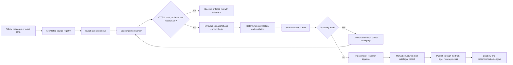

# ScholarPath opportunity ingestion system

## Scope

ScholarPath does not attempt an uncontrolled crawl of the internet. It operates a governed network of official scholarship, government, catalogue and university sources. Every extracted item is evidence, not recommendation truth, until a reviewer approves it.

## Governed end-to-end flow

## Implemented controls

- Official HTTPS source registration with staff-role checks and host allowlisting.
- SSRF protection, private-host rejection, redirect limits, timeouts, response-size limits and supported content-type checks.
- `robots.txt` enforcement and explicit blocked/failure states.
- Conditional requests using ETag and Last-Modified plus normalized SHA-256 change detection.
- Immutable source snapshots, versioned parser evidence, run history and exponential retry backoff.
- Catalogue discovery separated from detail extraction; discovery never auto-publishes.
- Cross-page candidate deduplication and preservation of superseded parser output.
- Human approve/reject controls, catalogue-lead adoption and audit events.
- Supabase Vault-backed worker key and a one-minute pg_cron schedule with queue back-pressure.
- Protected Super Admin interface for source health, manual registration, runs and review.

## Current live coverage

- 11 official EACEA catalogue pages covering 220 records.
- 215 secure HTTPS catalogue leads.
- 5 legacy HTTP-only leads retained with `source_url_insecure`; they cannot be adopted automatically.
- Detail adapters for programme and scholarship pages, including initial Chevening, DAAD, Ireland, Netherlands, Leeds, Saarland and Trinity sources.

## Publication boundary

The ingestion system intentionally stops before automatic publication. Programme level, subject family, country, intake, deadline, tuition, eligibility and funding fields must be independently resolved before a record enters the recommendation engine. Reviewers should adopt and enrich a focused set first, then expand source packs country by country.

## Operations

- Use `/admin` → **Opportunity Catalogue** to add sources, run checks and process the review queue.
- A secure discovery lead uses **Monitor & enrich** to become a scheduled detail source.
- Treat robots blocks, insecure URLs and unresolved dates as evidence-quality states, never as empty success.
- Pause a source that changes structure until its adapter is versioned and revalidated.
- Never paste service or worker keys into application data, logs, screenshots or tickets.

## Next source packs

Add only official, permitted sources in this order: Commonwealth Scholarships, Fulbright country commissions, Australia Awards, MEXT/Study in Japan, Turkiye Scholarships, Stipendium Hungaricum, EduCanada, Korea GKS, national study portals, and priority university course catalogues. Each source pack needs a documented owner, parser version, schedule, sample fixtures and reviewer acceptance before production use.
